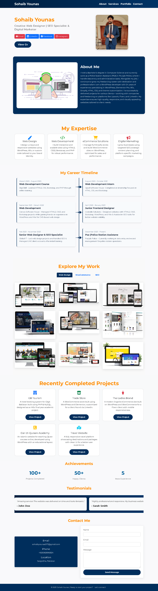

# Sohaib Younas – Creative Web Designer | SEO Specialist & Digital Marketer  Portfolio:

A modern, clean, and fully responsive portfolio website built to showcase my web design skills and freelance services. This site includes a project showcase, service highlights, and a contact section for potential clients. Designed using HTML5, CSS3, and Bootstrap, and hosted via GitHub Pages.

---
## 👨‍💻 About Me:

I hold a Bachelor’s degree in Computer Science and currently work as a Police Station Assistant (PSA) in Punjab Police, where I handle data entry and administrative tasks. Alongside my job, I continue to grow my freelancing career with dedication and professionalism.

I am a WordPress developer with 3+ years of experience, specializing in WordPress, Elementor Pro, Wix, Shopify, HTML, CSS, and theme customization. I’ve successfully delivered projects for various clients, working with companies and freelancing on platforms like Upwork, Fiverr, and LinkedIn. My expertise ensures the creation of high-quality, responsive, and visually appealing websites tailored to meet client needs.

---

## 🔗 Live Preview of Portfolio:

👉 [https://sohaibyounas076.github.io/portfolio/](https://sohaibyounas076.github.io/portfolio/)

---

## 📸 Screenshots

Homepage Preview:



....

## 🛠️ Technologies Used

- HTML5  
- CSS3  
- Bootstrap  
- GitHub Pages (for hosting)

---

## 📁 Folder Structure

```
portfolio/
│
├── css/
│   └── style.css
├── index.html
     └── html5
├── imag/
│   └── (all images + screenshot.png)
└── README.md
```

## 📩 Contact

Want to hire or collaborate with me? Feel free to reach out:

- 🌐 **Portfolio**: [https://sohaibyounas076.github.io/portfolio/](https://sohaibyounas076.github.io/portfolio/)  
- 📧 **Email**: sohaibyounas077@gmail.com  
- 🧑‍💼 **Lindin**: [https://Linkedin.com/sohaibyounas076](https://www.linkedin.com/in/sohaibyounas076/)

---

## 📝 Note

This project will be continuously updated with my latest work, and serves as a professional online presence for freelance clients.

