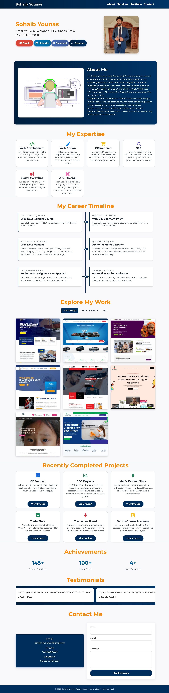

# Sohaib Younas – Web Designer Portfolio

A modern, clean, and fully responsive portfolio website built to showcase my web design skills and freelance services. This site includes a project showcase, service highlights, and a contact section for potential clients. Designed using HTML5, CSS3, and Bootstrap, and hosted via GitHub Pages.

---
## 👨‍💻 About Me

I'm **Sohaib Younas**, a passionate freelance web designer specializing in modern, responsive web development using tools like WordPress, Shopify, and Bootstrap. I also offer services in SEO and digital branding. This portfolio includes a project I successfully delivered through Fiverr, reflecting my real client experience and design capabilities.

---

## 🔗 Live Preview

👉 [https://sohaibyounas076.github.io/portfolio/](https://sohaibyounas076.github.io/portfolio/)

---

## 📸 Screenshots

Homepage Preview:



....

## 🛠️ Technologies Used

- HTML5  
- CSS3  
- Bootstrap  
- GitHub Pages (for hosting)

---

## 📁 Folder Structure

```
portfolio/
│
├── css/
│   └── style.css
├── index.html
     └── html5
├── imag/
│   └── (all images + screenshot.png)
└── README.md
```

## 📩 Contact

Want to hire or collaborate with me? Feel free to reach out:

- 🌐 **Portfolio**: [https://sohaibyounas076.github.io/portfolio/](https://sohaibyounas076.github.io/portfolio/)  
- 📧 **Email**: sohaibyounas077@gmail.com  
- 🧑‍💼 **Lindin**: [https://Linkedin.com/sohaibyounas076](https://www.linkedin.com/in/sohaibyounas076/)

---

## 📝 Note

This project will be continuously updated with my latest work, and serves as a professional online presence for freelance clients.

